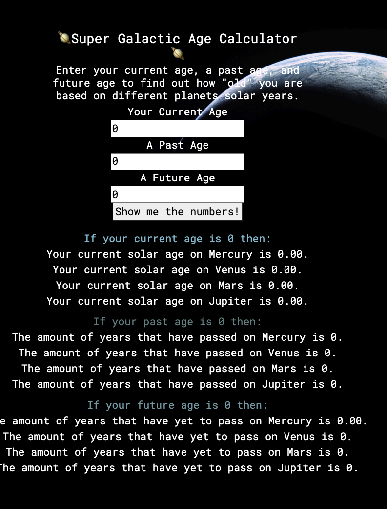

# 🪐Super Galactic Age Calculator🪐

#### Independent Project for Week 5 of Epicodus Coding School featuring the Red, Green, Refactor workflow and the E6 feature class.

#### By Eliot Gronstal 2.3.23 🌞

## Technologies Used

* 💫 JavaScript (ES6)
* 💫 Jest
* 💫 Webpack
* 💫 Lint
* 💫 NPM
* 💫 Github

## Description

Independent Project for Week 5 of Epicodus Coding School featuring the Red, Green, Refactor workflow and the E6 feature class. The business logic of my application will take a person's age in years and create a class that returns a user's age determines a user's age based on a planet's solar years. It will also determines how many years have passed on each planet since a past birthday and how many years have yet to pass until a future birthday.

## Setup/Installation Requirements

* 💫 Clone the repo down to your desktop.
* 💫 Open the project and review the functions for adjusting a birthdate to different solar years
* 💫 FYI for non-Mac users: in the package.json "scripts" for lint: line 9's has an extra " ' " surrounding src:... which allows es lint to access files recursively  "lint": "'eslint src/*.js'",

## Known Bugs

* 💫 No known bugs

* 💫 There are more planets that can be added (or removed: thinking of you, Pluto).

* 💫 Please reach out with any questions or concerns at: [eliot.lauren@gmail.com](eliot.lauren@gmail.com)

## Image Credit

* [Apollo 17, NASA; Restoration - Toby Ord](https://apod.nasa.gov/apod/ap230513.html)

## License

MIT

Copyright (c) 2023 Eliot Gronstal